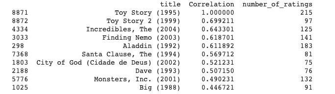

# What-To-Watch

What-To-Watch is a custom movie recommender system which suggests popular movies based on some custom ratings given by a user to a few movies from our huge pool. The suggestions for each user differ based on their movie choice.  

The project incorporates two methods to generate recommendations. One is a purely machine-learning based method which involves collaborative filtering based on low-rank matrix factorization from scratch and uses gradient descent as an optimization algorithm. This implementation is based on Dr Andrew Ng's Youtube lectures on Machine Learning.

The second method is a purely statistical project which correlates a movie with other movies from a dataset based on ratings and popularity and shows the closest positively correlated movies for a given movie from the dataset.

The data used is provided by IMDB and is open to everyone

## Results

Here is a list of movie-suggestions based on my preferences for many movies as per the first ML algorithm :

 

 

Here is a list of movie-suggestions similar to Toy Story (1995)  as per the second statistical algorithm :

 
 


## Installations and Setup


Use the package manager [pip](https://pip.pypa.io/en/stable/) to install the dependencies.


```bash
pip3 install -r requirements.txt
```
## Structure of the project
- The **train.py** file contains the model which needs to be trained the first time a user runs this project if the user wants the ratings to be as per his/her preferences. 
- The **predict.py** file contains the top movies which the model recommends for the specific user 
- The **train.p** file contains the weights used by the model after train.py has been run atleast once.
- The **corr.py** file contains the main script which gives us our results as per the second algorithm.
- Please explore the structure of the datasets in the **movies.csv** and **ratings.csv** files.

## Usage
# Algorithm 1
Please feel free to alter the ratings of the movies given in the excerpt below from **train.py** and experiment by adding ratings for some of your other favourite movies from the **movies.csv** file.
**While adding the movies please follow the structure I have used**
 

On your first run after giving custom ratings to some movies in **train.py** run
```python
python3 train.py
```
Be patient as this may take a while to train (up to 15 minutes)

After training to see the predictions run
```python
python3 predict.py
```

# Algorithm 2
Feel free to alter the movie for which you would like to see positive correlations. This can be done by replacing the given excerpt in the **corr.py** file with a movie name from the **name column** in the **movies.csv** file.

```python
movie_user_rating = movie_matrix['Toy Story (1995)']
```
Make sure you copy the name exactly as given in the **movies.csv** file.

After choosing the movie, to see the results run
```python
python3 corr.py
```


## Contributing
Pull requests are welcome. For major changes, please open an issue first to discuss what you would like to change.


## License
[MIT](https://choosealicense.com/licenses/mit/)
