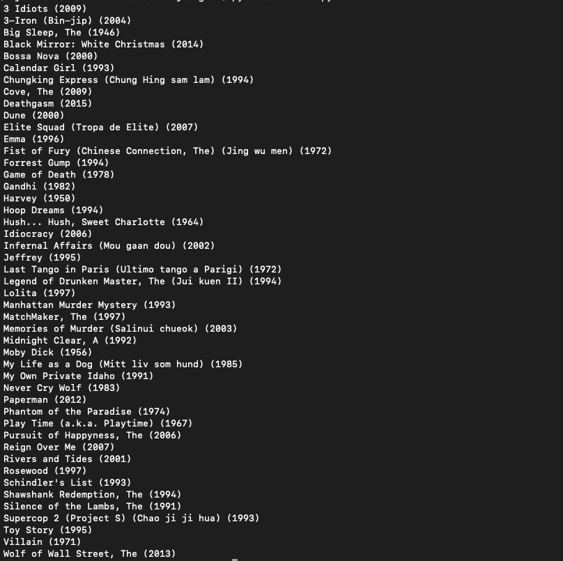
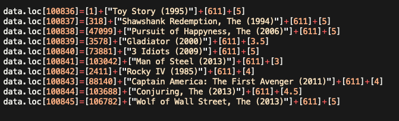

# What-To-Watch

What-To-Watch is a custom movie recommender system which suggests popular movies based on some custom ratings given by a user to a few movies from our huge pool. The suggestions for each user differ based on their movie choice.  


## Results

Here is a list of movie-suggestions based on my preferences  :

 

 


## Installations and Setup


Use the package manager [pip](https://pip.pypa.io/en/stable/) to install the dependencies.


```bash
pip3 install -r requirements.txt
```
## Structure of the project
- The **train.py** file contains the model which needs to be trained the first time a user runs this project if the user wants the ratings to be as per his/her preferences. 
- The **predict.py** file contains the top movies which the model recommends for the specific user 
- The **train.p** file contains the weights used by the model after train.py has been run atleast once.

## Usage
Please feel free to alter the ratings of the movies given in the excerpt below from **train.py** and experiment by adding ratings for some of your other favourite movies from the **movies.csv** file.
**While adding the movies please follow the structure I have used**
 

On your first run after giving custom ratings to some movies in **train.py** run
```python
python3 train.py
```
Be patient as this may take a while to train (up to 15 minutes)

After training to see the predictions run
```python
python3 predict.py
```

## Contributing
Pull requests are welcome. For major changes, please open an issue first to discuss what you would like to change.


## License
[MIT](https://choosealicense.com/licenses/mit/)
